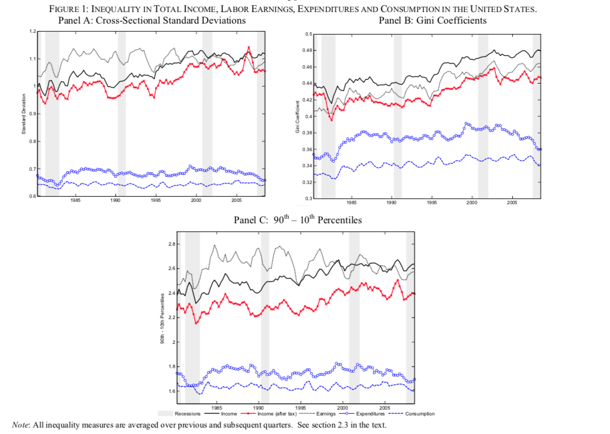
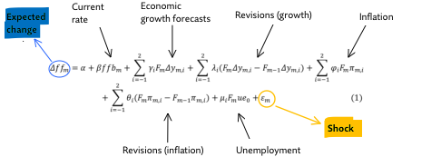
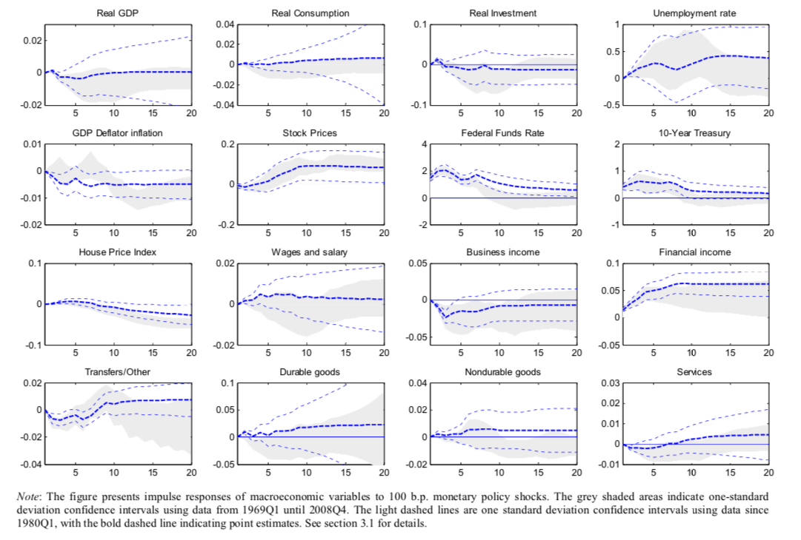
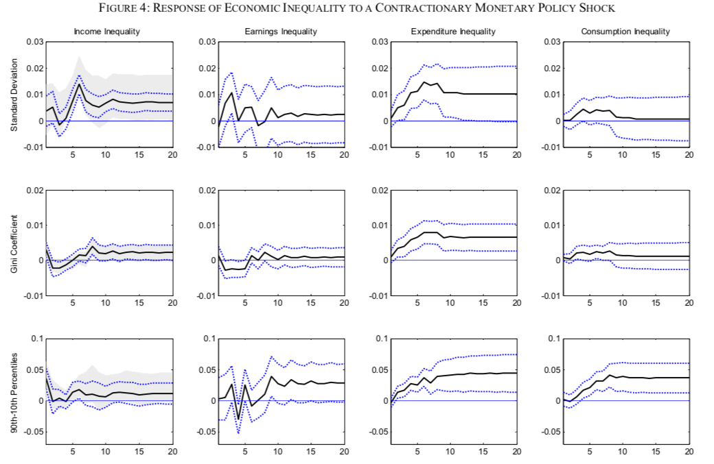
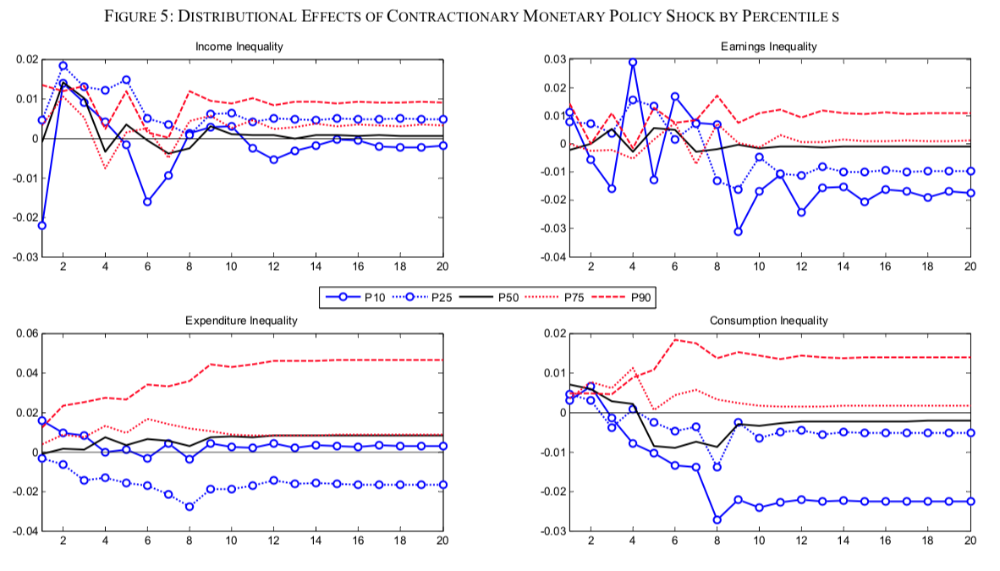
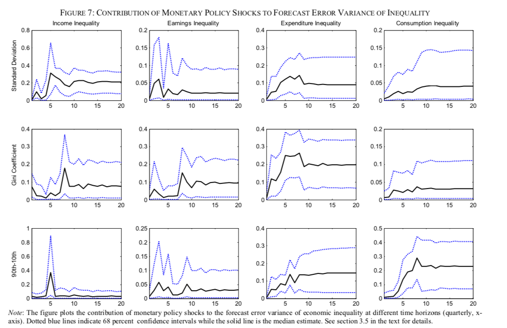

```{r setup, include=FALSE}
knitr::opts_chunk$set(echo = TRUE)
knitr::opts_knit$set(root.dir = "/Users/helenapatterson/Documents/BGSE/Term 2/Systemic Risks")
```

# Overview


## Motivation

- Notion that *expansionary* monetary policy primarily benefits the wealthy has become more prevalent
  - "low for long" environment will lead to "disastrous consequences" (@acemoglu2012captured)
- *Contractionary* monetary policy -- through its dampening effect on economic growth -- may be at the root of inequality
- Other popular theories as to what has been driving the rise in inequality including:
    1. Skill-biased technological change
    2. Global trade
    3. Unionization
    4. Lack of capital taxation [@piketty2013capital]

## Relevant papers

The doves:

- @coibion2017innocent (main focus here)
    - Contractionary monetary policy increases inequality in labour earnings, total income, consumption and total expenditures.
    - Size of the contribution of monetary policy shocks to inequality is of a similar magnitude as their contribution to other macroeconomic variables.
- @bunn2020has (BoE staff working paper):
    - Expansionary monetary policy (between 2008-2014) have been found to have reduced inequality, relative to the counterfactual of no change in policy.
    - Younger households (with less secure jobs, higher debts) experienced the largest welfare gains, whereas older households dependent on savings income are most likely to have been made worse off. 

The hawks:

- @andersen2020monetary:
    - ...

# Theoretical underpinnings

## Channels - the hawks

Expansionary monetary policy $\rightarrow$ rise in inequality

1. Income composition channel: heterogeneity across households in terms of primary sources of income, which in turn may be affected disproportionately by monetary policy.
2. Financial fragmentation channel: heterogeneity with respect to access to financial markets. Those more connected to financial markets may be the primary beneficiaries of expansionary monetary policy.
3. Portfolio channel: if low-income households tend to hold relatively more currency than high-income households, then inflationary pressures erode their net wealth.

@coibion2017innocent find evidence consistent with income composition channel: 

- Financial income rises sharply while business income labour earnings fall. Income transfers are found to be an effective tool to soften the blow.

## Channels - the doves

Contractionary monetary policy $\rightarrow$ rise in inequality:

1. Savings redistribution channel: an unexpected rise in interest rates hurts borrowers. (This may lead to a rise in inequality if we assume that poorer households tend to be net borrowers of wealthier households.)
2. Earnings heterogeneity channel: contractionary policy may cause a disproportionate increase in umemployment of low income groups.

@coibion2017innocent provide evidence consistent with the *earnings heterogeneity channel*: heterogeneous wage responses to contractionary shocks. 

# Data

## Household survey

- Measures of inequality come from detailed household-level data from the Consumer Expenditures Survey (CEX) since 1980:
    - monthly frequency (aggregated to quarterly), which is necessary to analyse the effect of (conventional) monetary policy shocks. 
    - provided by the Bureau of Labor Statistics (BLS)
    - CEX was and still is used for construction of CPI weights

## Distributional measures

Bother income and consumption inequality are measured through three different distributional measures:

a. Gini coefficients of levels (area under 45-degree line)
b. cross-sectional standard deviations of log levels
c. differences between individual percentiles of the cross-sectional distribution of log levels

- a. is widely used but subject to the influence of outliers. b. and c. are less subject to outliers and more in line with the narrative of the paper (focusing on income percentiles), but 0s need to be eliminated
- measures are unsurprsingly all highly correlated (though less so for the labor earnings inequality measures since here the effect of eliminating zeros plays a larger role.)

- income is further split into 1) labor earnings and 2) total income (labor earnings plus financial income, business income and transfers for each household)
- focus on pre-tax measures, but show that results are robust for after-tax measures.

## Inequality over time

- sharp rise in income inequality during early 80s - attributable to contractionary Volcker rule?



## Monetary policy shocks - short-term

@romer2004 model shocks as unexpected changes to the Fed Funds rate, conditional on prior information set revealed by Fed:



- Greenbook forecasts until December 2006; Blue Chip Economic Indicators in place of Greenbook forecasts for the FOMC meetings in 2007 and 2008

## Monetary policy shocks - reaction function

- @romer2004 is subject to endogeneity: preferences or objectives of the central bank and political constraints may play a role in these shocks.

- Instead of short-term shocks, may instead model permanent changes to Taylor-type rule based optimal interest rate and inflation targets.

# Empirical strategy

## Impulse response functions

Estimate ADL model in first differences

\begin{equation} 
\begin{aligned}
&& x_t&=\beta_0 + \sum_{j=1}^{J} \alpha_j x_{t-j} + \sum_{i=0}^{I} \beta_i \hat\varepsilon_{t-1}+v_t
\\
\end{aligned}
\end{equation}

where $J=8$ (2 years) and $I=12$ (3 years, conventional policy horizon) for the whole sample. Choices are small for restricted sample.

## VMA

Alternative approach models variables in their VMA representation

\begin{equation} 
\begin{aligned}
&& x_t&=\beta_0 + \sum_{i=0}^{N} \beta_i \hat\varepsilon_{t-1}+v_t
\\
\end{aligned}
\end{equation}

where $\beta_i$ directly correspond to IRF. May be less precise in shorter samples. 

## Additional shocks

Another approach includes shocks to other variables (T=technology, O=oil, F=fiscal) in the model:

\begin{equation} 
\begin{aligned}
&& x_t&=\beta_0 + \sum_{j=1}^{4} \alpha_j x_{t-j} + \sum_{i=0}^{8} \beta_i \hat\varepsilon_{t-1}+ \sum_{s \in \{T,O,F\}} \sum_{i=0}^{2} \gamma^s_i \hat\eta_{t-1}^s+v_t
\\
\end{aligned}
\end{equation}

## VAR

- Model system of endogenous variables $\mathbf{y}=(gdp, unemp, \pi, mp, ineq)$

$$
\textbf{Y}_t=\begin{bmatrix}
y_t & emp_t & \pi_t & mp_t & ineq_t 
\end{bmatrix}'
$$
where $\sum_{i=0}^t  \varepsilon_t^{(mp)}$.

- Cholesky decomposition in that order:

$$
\begin{aligned}
\mathbf{B}_0=
\begin{bmatrix}
B_{y,y} & 0 & 0 & 0 & 0\\
B_{emp,y} & B_{emp,emp} & 0 & 0 & 0\\
B_{\pi,y} & B_{\pi,emp} & B_{\pi,\pi} & 0 & 0\\
B_{mp,y} & B_{mp,emp} & B_{mp,\pi} & B_{mp,mp} & 0 \\
B_{ineq,y} & B_{ineq,emp} & B_{ineq,\pi} & B_{ineq,mp} & B_{ineq,ineq} \\
\end{bmatrix}
\end{aligned}
$$

# Results

## Standard macro variables

- IRFs have expected shape: 

<!-- - IRFs have expected shape: in response to contractionary monetary policy shocks... -->
<!--     - GDP, consumption, investment down, inflation down with lag. -->
<!--     - Unemployment up, yield curve up. -->
<!-- - In addition: house prices down, stock prices down initially then up. -->
<!-- - With respect to income: real wages unchanged, but business income drops rapidly, financial income rises. -->
<!-- - Transfers drop initially, before rising $\rightarrow$ important consequences for total income inequality.  -->



## Inequality

Positive, statistically significant effect of monetary policy shocks on inequality.



## Distributional effects in detail

- Bottom left panel is the *killer chart*: in response to contractionary monetary policy shocks labour earnings increase for high-income groups, while the decrease for low-income groups.

<!-- - Bottom left panel is the *killer chart*: in response to contractionary monetary policy shocks labour earnings increase for high-income groups, while the decrease for low-income groups. -->

<!-- - Muted effect on total income attribute to income composition: bottom percentiles (poorer) draw on other sources of income including unemployment insurance.  -->

<!-- - For higher income categories, labour income plays a much larger role. This mitigates the negative effects of contractionary policy on their total income. -->

<!-- - Had the top 1 percent been included, the estimated impact in inequality would likely be even higher since they draw most of their income from financial income, which rises with contractionary shocks. -->

<!-- - Bottom right panel reflecting consumption is almost identical to bottom left. -->



## Economic signifcance

FEVDs reveal significant contribution of monetary policy shocks to variation in inequality.



- Historical contribution is shown to have increased

## Robustness checks

- Vary lag length: consistent.
- Discard Volcker disinflation period: consistent.
- Discard recessions: consistent.
- VMA approach: results less precise/significant.
- Controlling for additional shocks: magnitudes broadly unchanged, but results more precise/significant.
- VAR approach: consistent.
- Controlling for household characteristics: magnitudes broadly unchanged, but results more precise/significant.
- Shocks to reaction function: Results are qualitatively and quantitatively very similar.

## Caveats

- CEX data does not include top 1 percent, but if anything that can be expected to downward-bias the estimates.
- Households are moving across the distribution through time
  - Authors check for this: find no significant impact of mon pol shocks on transition probabilities after two years, but effect in first 2 years may be reason for volatility of IRFs in that time frame.
- CEX underreports consumption relative to aggregate data and that this underreporting has become more severe over time. the potential underreporting of consumption in the CEX is less of a concern, since we will focus on cyclical fluctuations in consumption inequality
- ordering of the VAR model seems somewhat arbitrary: imposes that inequality reacts contemporaneously to all other covariates

# The Central Banker View - @bunn2020has (BoE staff working paper)

## Methodology

Measured using household utility function of the form:

$$
\begin{aligned}
U = \phi(\alpha(y), \beta(w), \gamma(X))
\end{aligned}
$$


Approach to estimation assumes that subjective well-being, u, is linked to try household utility:

$$
\begin{aligned}
u_{it} = \alpha_{i} + \delta_{t}\frac{y_{it}^{1-\theta}}{1-\theta}+\gamma_{t}\frac{w_{it}^{1-\theta}-1}{1-\theta} + \Sigma j\beta_{j}x_{jit}+\gamma_{t} + \epsilon_{it}
\end{aligned}
$$

## Results

- Welfare benefits have been positive, mostly through non-financial rather than conventional financial means.
- Results contrast with the negative public perceptions of the impact of looser monetary policy. 
- Authors' take-aways highlight the importance of Central Bank communication.


## Looking Forwards

- Numerous channels through which monetary policy operates means difficulty in gauging effectiveness.
- Arguably historically fiscal policy has played a deeper role in welfare [@piketty2013capital]
- Nonetheless, covid-19 and the extraordinary measures undertaken by CBs means fiscal and monetary lines have become more blurred.


## References

::: {#refs}
:::


