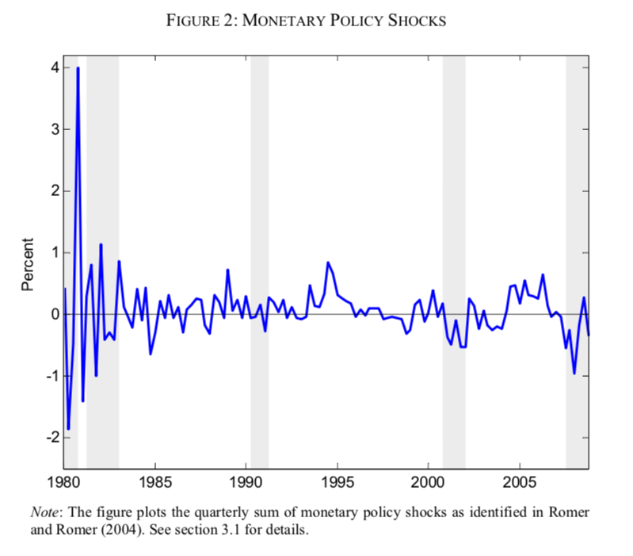
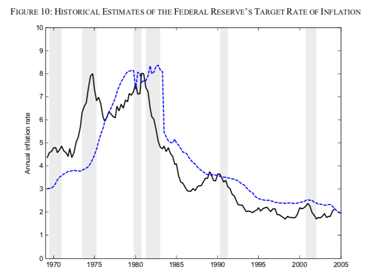

```{r setup, include=FALSE}
knitr::opts_chunk$set(echo = FALSE)
```

# @coibion2012innocent

## High-level results

- Contractionary (hawkish) monetary policy increases inequality in labor earnings, total income, consumption and total expenditures.
- Findings are robust with respect to the sample and estimation methods.
- Findings are also largely independent of other observable household characteristics.
- Estimated effects are significant in magnitude: variance decompositions reveal that the size of the contribution of monetary policy shocks to inequality is of a similar magnitude as their contribution to other macroeconomic variables.

## Contributions 

- topic had previously received little attention in the economics literature, although the causal link had been discussed outside of mainstream economics.

## Motivation

- "low for long" paradigm will have "disastrous consequences" (@acemoglu2012captured)
- notion that expansionary (dovish) monetary policy primarily benefits the wealthy has become more prevalent
- The are other popular theories as to what has been driving the rise in inequality including:
    1. Skill-biased technological change
    2. Global trade
    3. Unionization
- Even more at odds with these more traditional theories is the idea that *contractionary* monetary policy through its dampening effect on economic growth may be at the root of inequality

## Channels

The hawks: expansionary monetary policy $\rightarrow$ rise in inequality

1. Income composition channel: heterogeneity across households in terms of primary sources of income, which in turn may be affected disproportionately by monetary policy.
2. Financial fragmentation channel: heterogeineity with respect to access to financial markets. Those more connected to financial markets may be the primary beneficiaries of expansionary monetary policy.
3. Portfolio channel: if low-income households tend to hold relatively more currency than high-income households, then inflationary pressures erode their net wealth.

@coibion2012innocent find evidence consistent with income composition channel: financial income rises sharply while business income declines after contractionary monetary policy shocks. The top 1 percent of the income distribution received approximately 30 percent of their income from financial income [@coibion2012innocent]. Income transfers are found to be an effective tool to soften the blow of contractionary shocks for low-income households.

The doves: contractionary monetary policy $\rightarrow$ rise in inequality:

1. Savings redistribution channel: an unexpected rise in interest rates hurts borrowers. (This may lead to a rise in inequality if we assume that poorer households tend to be net borrowers of wealthier households.)
2. Earnings heterogeneity channel: contractionary policy may cause a disproportionate increase in umemployment of low income groups.

@coibion2012innocent provide evidence consistent with the *earnings heterogeneity channel*: heterogeneous wage responses to contractionary shocks. 

## Data

- measures of inequality come from detailed household-level data from the Consumer Expenditures Survey (CEX) since 1980. Quarterly frequency, which is necessary to analyse the effect of (conventional) monetary policy shocks. 
- provided by the Bureau of Labor Statistics (BLS), consists of two separate surveys, the Interview Survey and the Diary Survey. @coibion2012innocent focus on the former only, which provides information on up to 95 percent of typical household's consumption expenditures.
- CEX was and still is used for construction of CPI weights. Frequency is monthly with with 1,500-2,500 households interviewed in any given month.
- within- interview variation is much lower than the between-interview variation, suggesting that many households provide average monthly expenditures instead.
- aggregated to quarterly 

- sharp rise in income inequality during early 80s - attributable to contractionary Volcker rule?


## Methodology

### Proxy construction

- Monetary policy shocks are identified through:

a. Romer and Romer (2004) procedure as innovations to the Fed Funds rate which are uncorrelated with information revealed by the Fed prior to the FOMC meeting.

b. Shocks to the Fed's inflation target: permanent decreases in the inflation target (contractionary) also systematically increase income and consumption inequality.

- Proxy a. is subject to endogeneity: preferences or objectives of the central bank and political constraints may play a role in these shocks.

Using the real-time forecasts of the Fed staff presented in the Greenbooks prior to each FOMC meeting (denoted by F), RR construct a measure of monetary policy shocks defined as the component of policy changes from each meeting which is orthogonal to the Fed’s information set, as embodied by the Greenbook forecasts.


- extend the Greenbook forecasts until December 2006, the most recent period through which the Federal Reserve has released them.
- use consensus forecasts from the Blue Chip Economic Indicators in place of Greenbook forecasts for the FOMC meetings in 2007 and 2008


Measures of inequality:

Bother income and consumption inequality are measured through three different distributional measures:

a. Gini coefficients of levels (area under 45-degree line)
b. cross-sectional standard deviations of log levels
c. differences between individual percentiles of the cross-sectional distribution of log levels

- a. is widely used but subject to the influence of outliers. b. and c. are less subject to outliers and more in line with the narrative of the paper (focusing on income percentiles), but 0s need to be eliminated
- measures are unsurprsingly all highly correlated (though less so for the labor earnigns inequality measures since here the effect of eliminating zeros plays a larger role.)

- income is further split into 1) labor earnings and 2) total income (labor earnings plus financial income, business income and transfers for each household)
- focus on pre-tax measures, but show that results are robust for after-tax measures.

### Impulse response functions

Estimate ADL model in first differences

\begin{equation} 
\begin{aligned}
&& x_t&=\beta_0 + \sum_{j=1}^{J} \alpha_j x_{t-j} + \sum_{i=0}^{I} \beta_i \hat\varepsilon_{t-1}+v_t
\\
\end{aligned}
(\#eq:adl)
\end{equation}

where $J=8$ (2 years) and $I=12$ (3 years, conventional policy horizon) for the whole sample. Choices are small for restricted sample.

Alternative approach models variables in their VMA representation


\begin{equation} 
\begin{aligned}
&& x_t&=\beta_0 + \sum_{i=0}^{N} \beta_i \hat\varepsilon_{t-1}+v_t
\\
\end{aligned}
(\#eq:vma)
\end{equation}

where $\beta_i$ directly correspond to IRF. May be less precise in shorter samples. 

Another approach includes shocks to other variables (T=technology, O=oil, F=fiscal) in the model:

\begin{equation} 
\begin{aligned}
&& x_t&=\beta_0 + \sum_{j=1}^{4} \alpha_j x_{t-j} + \sum_{i=0}^{8} \beta_i \hat\varepsilon_{t-1}+ \sum_{s \in \{T,O,F\}} \sum_{i=0}^{2} \gamma^s_i \hat\eta_{t-1}^s+v_t
\\
\end{aligned}
(\#eq:adl_x)
\end{equation}

## Results

### Standard macro variables

IRFs have expected shape: in response to contractionary monetary policy shocks, GDP down, consumption down, investment down, unemployment up, yield curve up, inflation down with lag. In addition: house prices down, stock prices down initially then up.

With respect to income: real wages unchanged, but business income drops rapidly, financial income rises. Transfers drop initially, before rising $\rightarrow$ distirbutional consequences. 

"Contractionary monetary policy will tend raise incomes for those who receive a lot of financial income but lower incomes for business owners."


### Inequality

Positive, statistically significant effect of monetary policy shocks on inequality.


Robustness checks:

- vary lag length: consistent
- Discard Volcker disinflation period: consistent
- Discard recessions: consistent
- VMA approach: results less precise/significant
- controlling for additional shocks: magnitudes unchanged, but results more precise/significant
- VAR approach with $\mathbf{y}=(gdp, unemp, \pi, mp, ineq)$: consistent
- Controlling for household characteristics: magnitudes unchanged, but results more precise/significant

## Distributional effects in detail

Bottom left panel is the *killer chart*: in response to contractionary monetary policy shocks labour earnings increase for high-income groups, while the decrease for low-income groups.

Muted effect on total income attribute to income composition: bottom percentiles (poorer) draw on other sources of income including unemployment insurance. For higher income categories, labour income plays a much larger role. This mitigates the negative effects of contractionary policy on their total income.

Had the top 1 percent been included, the estimated impact in inequality would likely be even higher since they draw most of their income from financial income, which rises with contractionary shocks.

Bottom righ panel reflecting consumption is almost identical to bottom left.


## Economic signifcance

FEVDs reveal significant contribution of monetary policy shocks to variation in inequality.


Historical contribution is shown to have increased.

- Why not use a historical decomp for this??

## Permanent changes to the reaction function

Instead of shocks, the focus he is on permanent changes to Taylor-type rule based optimal target rates. 

Results are qualitatively and quantitatively very similar.



## Caveats

- CEX data does not include top 1 percent, but if anything that can be expected to downward-bias the estimates.
- Households are moving across the distribution through time
  - Authors check for this: find no significant impact of mon pol shocks on transition probabilities after two years, but effect in first 2 years may be reason for volatility of IRFs in that time frame.
- CEX underreports consumption relative to aggregate data and that this underreporting has become more severe over time. the potential underreporting of consumption in the CEX is less of a concern, since we will focus on cyclical fluctuations in consumption inequality
- ordering of the VAR model seems somewhat arbitrary: imposes that inequality reacts contemporaneously to all other covariates
